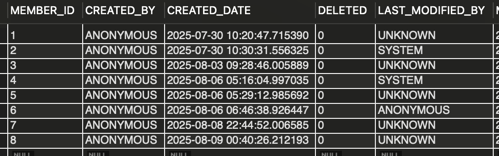
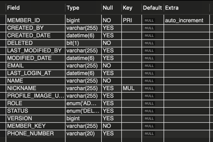

# 데이터베이스의 큰 그림

**데이터 베이스**: 기능 동작에 필요한 저장되어야 하는 데이터의 집합
**DBMS(Database Management System)**: 데이터 베이스를 관리하는 시스템

## 응용프로그램 입장에서 DBMS는 서버다.

* 응용프로그램(Client) <-> DBMS(Server), Client-Server 구조
    * 즉 통신을 하기 위해 **3-Way-Hand-Shake** 과정으로 TCP 연결이 필요하다.
    * 요청 방식은 Query를 활용

## 파일 대신 DB를 왜 사용할까?

> DBMS 주요 기능과 연관있다.

* 파일은 데이터 **일관성과 무결성 제공이 어렵다**.
    * DBMS가 서버와 같다는 것은 동시다발적으로 이용하는 클라이언트가 존재한다.
        * Race Condition 문제가 발생할 여지가 있다. -> **데이터 일관성 훼손**
    * 무결성 제약 조건 검증 시, 작성된 내용을 일일이 다 확인해봐야한다.
        * 레코드 단위가 아닌 파일 단위의 한계
* 불필요한 **중복 저장**이 많이 발생한다.
    * Join 절 같은 것이 없기 때문에 저장된 데이터를 식별하기 위한 기준이 중복해서 사용됨.
* 데이터 변경 시 연관 데이터 변경이 어렵다.
    * 중복 저장과 연관성이 있는 것
    * 1개를 변경한다면 중복 저장이 된 n개를 변경해야 된다.
* 정교한 검색이 어렵다.
    * Where 절 같은 것이 없기 때문에, 어플리케이션 레벨에서 다 수정해야 했다.
    * 현대는 grep과 같은 다양한 명령어가 제공 되어서 정교한 검색도 가능하다.
    * 다만, 다른 파일과 연관된 검색은 여전히 한계점이 있다.
        * 탐색 범위, 여러 단계에 걸친 검색
* 백업 및 복구가 어렵다.

## 데이터베이스의 저장 단위와 트랜잭션

> 저장 단위

* 엔티티(Entity): 독립적으로 존재할 수 있는 개체
* 속성(Attribute): 엔티티의 특성
* 릴레이션(Relation): 이차원 테이블 형태의 엔티티 집합
    * 같은 속성을 공유하는 엔티티
    * 컬렉션(Collection): NoSQL 중 MongoDB의 Relation 표현 단위
* 레코드(Record): 저장된 엔티티들을 표현하는 단위
* 필드(Field): 저장된 엔티티들의 속성을 표현하는 단위
    * 도큐먼트(Document): MongoDB의 표현 단위
    * 필드의 수를 차수(Degree)라고 함.
    * 필드에서 중복되지 않는 고유한 값들을 카디널리티(Cardinality)라고 함.

해당 사진만 보면 차수: 5, MEMBER_ID 카디널리티: 8, CREATED_BY 카디널리티: 1, 레코드 수: 8

> 스키마 (Schema)

* DB에 저장되는 레코드 구조와 제약 조건을 정의한 틀
    * 파일 데이터의 일관성 및 무결성을 해결하는 논리적인 구조
    * NoSQL은 Schema-less DB라고도 한다.

> 트랜잭션과 ACID

* 데이터베이스가 논리적으로 처리하는 방법
* 트랜잭션(Transaction): DB가 처리하는 작업의 단위
    * 초당 처리하는 작업 단위(TPS)
    * 여러개의 쿼리가 포함 될 수 있음
* ACID: 동시다발적으로 실행되는 여러 트랜잭션이 지켜야하는 4가지 성질
    * **원자성 (Atomicity)**: 하나의 트랜잭션 결과가 모두 성공하거나 실패하는 성질
        * 트랜잭션 내 두 가지의 이상의 쿼리가 발생했을 때, 하나가 실패하면 모두가 실패해야함.
        * All or Nothing, 일부 실패는 허용하지 않는다.
        * 모두 다 성공 -> 커밋(Commit)으로 트랜잭션 종료
        * 롤백(Rollback)으로 트랜잭션 취소 가능 -> 트랜잭션 시작 지점으로 복구
    * **일관성 (Consistency)**: 트랜잭션 전후로 DB가 일관된 상태를 유지하는 성질
        * constraint를 지켜야 하는 것
    * **격리성 (Isolation)**: 동시에 수행되는 여러 트랜잭션이 서로 간섭하지 않는 성질
        * 레이스 컨디션을 해결하는 성질, 동시에 접근하는 문제를 해결
    * **지속성 (Durability)**: 트랜잭션 성공 후 결과가 영구적으로 반양되는 성질
        * 트랜잭션 성공 후 시스템 장애가 발생해도 완료된 트랜잭션이 보장된다.
        * 성공 응답 후 저장하는 과정에서 시스템 장애로 저장이 되지 않을 수 있으므로 현대 DBMS는 회복 매커니즘을 구현
  