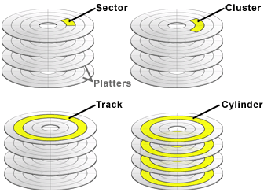
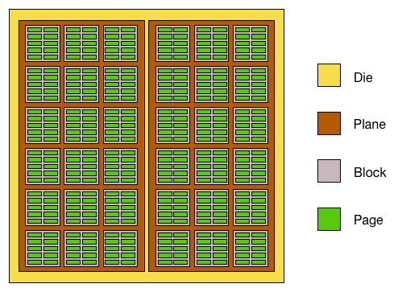
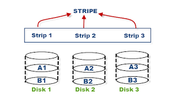

# 다양한 보조 기억 장치

## HDD

* 자기적인 방식으로 데이터를 저장 (자기 디스크)
* HDD의 원판 모양: 플래터 (platter)
* 플래터를 회전 시키는 구성 요소: 스핀들 (spindle)
  * 분당 회전수 RPM (Revolution Per Minute)
* 플래터를 대상으로 읽고 쓰는 구성 요소: 헤드 (head)
* 헤드와 부착되어 헤드를 이동 시키는 요소: 디스크 암 (disk arm)
* 즉, 플래터는 스핀들을 통해 돌아가고, 디스크 암에 부착된 헤드로 읽고 쓴다.

### 플래터

* 트랙(track)과 섹터(sector) 단위로 데이터를 저장
* 섹터 여러개가 모여 트랙을 구성
  * 섹터는 한 트랙에서 여덟 조각으로 나뉨
* 여러 플래터의 같은 트랙끼리 마주보는 원통을 실린더라고 함.

    
  (출처 네이버 블로그)

* 연속된 정보는 실린더에 기록된다.
  * 헤드의 움직임을 최소 -> 속도 향상
  * 실린더를 기준으로 각 플래터의 섹터 앞면, 뒷면에 기록
  * 참조 지역성

### 데이터 접근 시간

* 탐색 시간(seek time)
  * 데이터가 저장된 트랙까지 헤드를 이동 시키는 시간
  * 헤더는 마치 여의봉이다. 앞 뒤로 길어지고 짧아진다.
  * 트랙 별로 구성되는 실린더로 접근하기 위해 앞 뒤로 길어지고 짧아진다.
  * 다중 헤드 디스크 (multiple-head disk)는 탐색 시간이 0이다.
    * 고정 헤드 디스크라고도 한다.
* 회전 지연 (rotational latency)
  * 헤더가 있는 곳으로 플래터를 회전 시키는 시간
  * 헤더는 고정되어있다. 스핀들에 의해 플래터가 회전된다.
  * 이 때, 헤더에 원하는 결과가 도착하는데까지 스핀들이 동작하는 시간이다.
* 전송 시간 (transfer time)
  * HDD와 PC 간 데이터를 전송하는 시간이다.
  * 메모리에 올리기 위해 데이터 버스, 입출력 시간 등 등

## 플래시 메모리 (Flash memory)

* 전기적으로 데이터를 읽고 쓰는 반도체 기반의 저장 장치
  * USB, SD, SSD, ...
  * NAND 플래시 메모리: 일반적인 대용량 저장 장치를 의미 SSD
  * NOR 플래시 메모리

### 셀 (Cell)

* 플래시 메모리에서 데이터를 저장하는 가장 작은 단위
* SLC(Single Level Cell) Type, 1cell = 1bit 
* MLC(Multiple Level Cell) Type, 1cell = 2bit
* TLC (Triple Level Cell) Type, 1cell = 3bit
* QLC (Quad Level Cell) Type, 1cell = 4bit

### Cell보다 더 큰 단위

  
(출처: flashdba)
* Page: group of cell
* Block: group of page
* Plane: group of block
* Die: group of Plane

### 페이지

* 읽기와 쓰기의 단위
  * 삭제는 블럭 단위로 구성된다.
    * 플래시 메모리의 특징
* Free Status
  * 새로운 데이터를 저장할 수 있는 상태 (현재 페이지에 데이터가 없음)
* Valid Status
  * 유효한 데이터르 저장하고 있는 상태
  * HDD와 달리 덮어쓰기가 불가능, Valid라면 새 데이터를 저장할 수 없다.
    * 덮어쓰기 시, 기존의 데이터는 Invalid 상태로 만들어버리는 전략을 선택
* Invalid Status
  * 유효하지 않는 데이터를 저장하고 있는 상태 (쓰레기 값)
  * 욜량 낭비가 되므로 가비지 컬렉션 (garbage collection)
    * 유효한 페이지들만 새 블록으로 복사
    * 기존의 블록은 제거

# RAID의 정의와 종류

* RAID (Redundant Array ofo Independent Disks)
  * 여러개의 물리적 보조기억장치를 하나의 논리적 보조 기억장치로 사용

## RAID의 종류

* RAID Level: RAID 구성 방법 
  * RAID 0, 1, 2, 3, 4, 5, 6, ... 10, 50, ETC

### RAID 0 

  
(출처: Storage Tutorials)

* 여러개의 보조기억장치에 데이터를 단순히 나누어 저장하는 구성 방식
* stripe: 여러 디스크 간 분산되어 저장된 데이터
* striping: 여러 디스크 간 부산하여 저장하는 것
* 하나의 기억 장치에서 여러 정보를 가져오는 것은 느리다.
  * 1초에 100개를 가져오는 것 vs 1초에 50개를 가져오는 것 4개로 병렬 = 1초에 200개
* 단점으로 저장된 정보가 안전하지 않다.
  * 디스크 중 하나에 문제가 발생하면, 전체에 문제가 생긴다.
  * 머리, 몸통, 다리가 있으면 머리와 몸통만 조합하는 느낌

### RAID 1

* 복사본을 만드는 Mirroring
* RAID 0 에서 4개로 구성한다고 가정
  * 2개는 RAID 0, 2개는 RAID 0 을 복사
  * 비용이 비싸지고, 그만큼 용량 낭비가 발생
  * 다만 안전
    * 하나의 RAID 0 에서 장애가 발생하면
    * 복사본에서 복구 가능 (가용성)

### RAID 4

* RAID 1처럼 완전한 복사본 대신, 패리티를 저장한 장치를 이용
  * 오류 검출, 오류 발견 시 복구
  * RAID 1는 2 by 2 striping 였음.
  * RAID 4는 3 striping + parity disk
    * RAID 1보다 성능 향상
  * 패리티는 본래 오류 검출용이지만, RAID 4에서는 복구 로직도 포함

### RAID 5

* RAID 4에서 three striping disk 가 병렬로 패리티 disk 에서 검사
  * parity disk deadlock
  * 4 striping 을 두고 각 disk 특정 stripe 에 패리티 검출 stripe 를 위치
    * 패리티도 분산하면서 RAID 4 병목을 해결

### RAID 6

* RAID 5 와 구성은 동일 
* 패리티 stripe를 두 개 두면서 안전성을 더욱 높임.
  * 대신 새 정보마다 함께 저장하는 패리티가 두개이므로 RAID 4보다 성능이 조금 더 낮음

### Nested RAID

* 여러 RAID 레벨을 혼합한 방식
* RAID0 + RAID1 = RAID 10
* RAID0 + RAID5 = RAID 50
